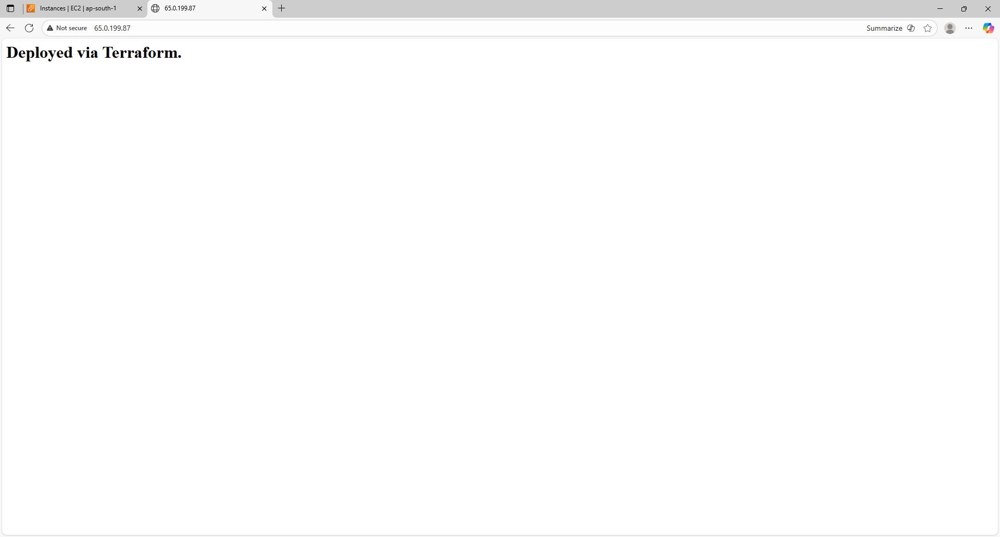

#  Terraform Project: EC2 Instance with NGINX Web Server

This Terraform project deploys an **Amazon EC2 instance** running an **NGINX web server** that serves a custom webpage displaying the text:

> **"Deployed via Terraform."**

The configuration is fully parameterized using variables, making it reusable for different environments (e.g., `dev`, `prod`).

---

## Features

- Deploys an EC2 instance on AWS.  
- Installs and runs NGINX automatically on startup.  
- Displays a custom HTML page with “Deployed via Terraform.”  
- Configurable instance type, key pair, region, and environment.  
- Security group allows:
  - **HTTP (port 80)** for web traffic.
  - **SSH (port 22)** for remote access.

---
##  Prerequisites

- AWS account with sufficient permissions  
- [Terraform](https://developer.hashicorp.com/terraform/downloads) installed (v1.5 or later)
- AWS CLI configured with valid credentials 

---

##  Deployment steps using commands

1. Initialize terraform : terrafor init

2. Review the execution plan : terraform plan

3. Apply the configuration for dev environment : 
    terraform apply -var-file="terraform-dev.tfvars"

4. Instance Public IP will be generated in the output 
    "instance_public_ip"
    

5. View custom nginx page that is configured in userdata.sh via url 
    http://<PUBLIC_IP>
    