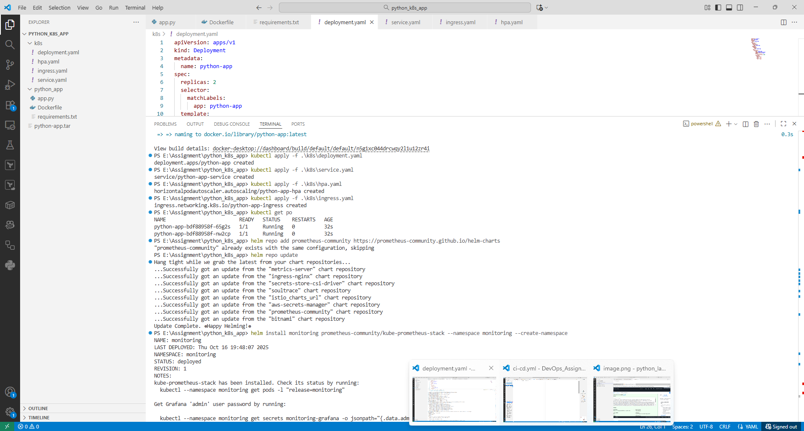
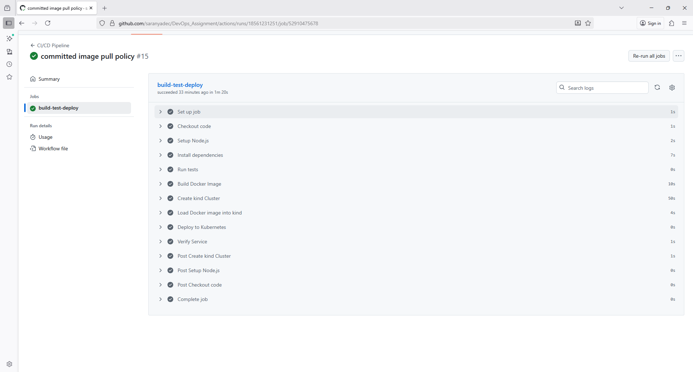

# Node.js CI/CD with Kubernetes (Kind)

This project demonstrates a simple **CI/CD pipeline** using GitHub Actions to build, test, and deploy a **Node.js application** to a local **Kubernetes cluster (Kind)**.

---

# Features

- Node.js backend application
- Dockerized container
- CI/CD workflow with **GitHub Actions**
- Deployment to local Kind Kubernetes cluster
- Service exposed via **ClusterIP** and accessed with port-forward

---

# Prerequisites

- Windows 11 / Linux / macOS
- [Docker Desktop](https://www.docker.com/products/docker-desktop)
- [kubectl](https://kubernetes.io/docs/tasks/tools/)
- [Kind](https://kind.sigs.k8s.io/)
- GitHub account (for CI/CD)

---

# Setup Local Kubernetes (Kind)

1. Create a Kind cluster:

```bash
kind create cluster --name node-cicd
Build and Deploy Locally

# Setup Local Kubernetes (Kind) &  Load image into Kind:

    docker build -t node-cicd-kind:latest .
    kind load docker-image node-cicd-kind:latest --name node-cicd

# Deploy to Kubernetes:

    kubectl apply -f k8s/deployment.yaml
    kubectl apply -f k8s/service.yaml

# Checking for pod logs

    kubectl logs node-app-654b675659-ntzhg

    > node-cicd-kind@1.0.0 start
    > node src/app.js

    App running at http://localhost:3000

# Access app via port-forward:

    kubectl port-forward svc/node-app-service 30080:3000

Open in browser: http://localhost:30080



CI/CD Pipeline (GitHub Actions)

    Runs on push or pull request to the branch feature/task2/saranya.

    Steps include:

    Checkout code

    Setup Node.js

    Install dependencies

    Run tests

    Build Docker image

    Create Kind cluster

    Load Docker image into Kind

    Deploy application

    Rollback if deployment fails

Kubernetes Configuration:

Deployment (k8s/deployment.yaml)

    2 replicas of Node.js app

    Image: node-cicd-kind:latest

    Container port: 3000

    ImagePullPolicy: Never (use local Kind image)

Service (k8s/service.yaml)

    Type: ClusterIP

    Port: 3000

    Access via kubectl port-forward

Pipeline will be triggered once the local repository is merged to github remote repository and the pipeline result will look like,


