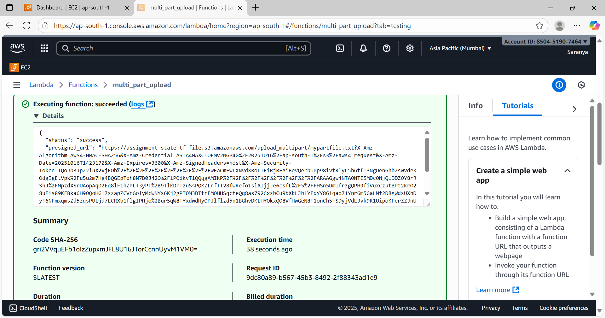

# S3 File Uploader

A Python script to upload files to an AWS S3 bucket. It supports large files with multipart uploads, basic error handling, logging, and  presigned URL generation.

---

## Features

- Upload any file to a specified S3 bucket.
- Automatically uses multipart upload for files larger than 100 MB.
- Logs all actions (file name, size, status, timestamp) to `upload.log`.
- Basic error handling with retries on failure.
- Generates a presigned URL for sharing uploaded files.

---

## Requirements

- Python 3.8+
- `boto3` library
- IAM role with necessary permission to get and post the objects
- AWS credentials configured 

---

Configured Test events for lambda functions as:

{
  "source_bucket": "assignment-state-tf-file",
  "source_key": "source_bucket/test_110mb.txt",
  "destination_bucket": "assignment-state-tf-file",
  "destination_key": "upload_multipart/mypartfile.txt"
}

Result:
Lambda function is trigger and pre-signed url is generated as shwon in screenshot,

